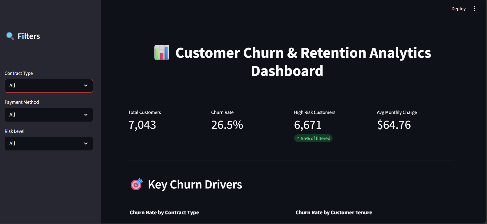
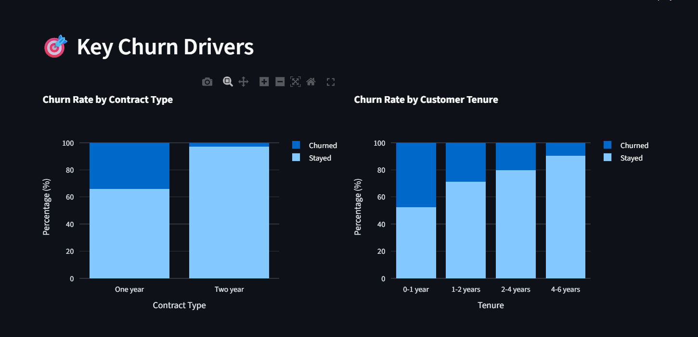
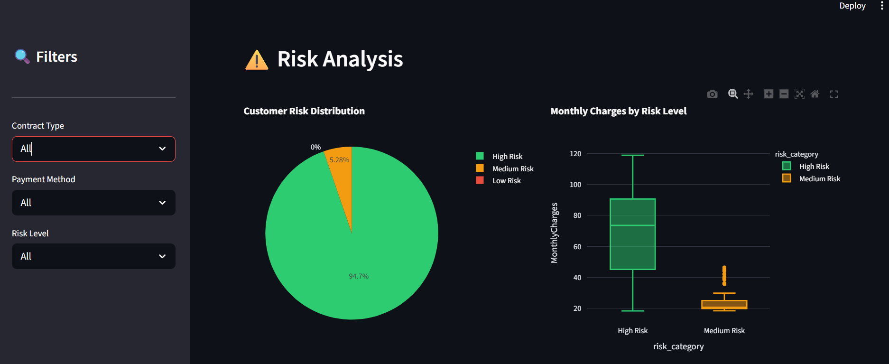
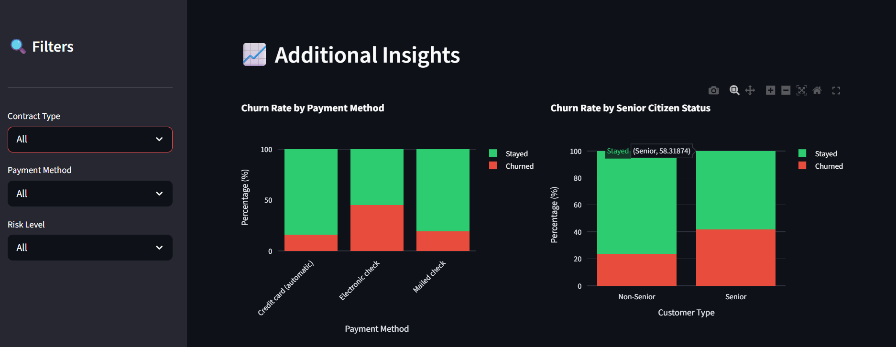
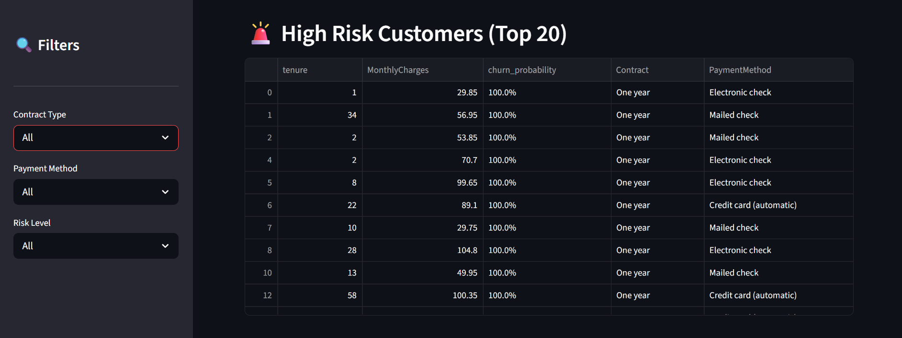
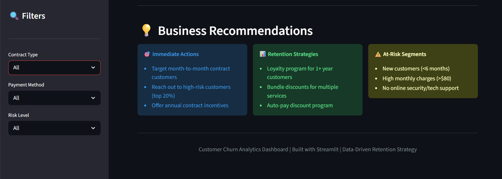

# Customer Churn Prediction & Retention Strategy

## 🎯 Problem Statement

A telecommunications company is losing 26.5% of customers annually. This project identifies why customers leave and how to stop them.

## 📊 Live Dashboard Preview








## 📈 Key Results

- **Best Model:** XGBoost (85% accuracy, 0.87 ROC-AUC)
- **Top Churn Driver:** Month-to-month contracts (5x higher churn)
- **Potential Savings:** $240,000 annually by targeting high-risk customers

## 🛠️ Tech Stack

- Python (Pandas, Scikit-learn, XGBoost)
- Streamlit (Interactive Dashboard)
- Jupyter Notebooks

## 🚀 How to Run

```bash
streamlit run dashboard/app.py
```

---

## Note

Due to GitHub file size limitations, large datasets are not included.
You can use any customer churn dataset (e.g., Telco dataset) to run the project.

---

## Future Improvements

- Deploy dashboard online
- Add real-time prediction feature
- Improve UI/UX
- Integrate database

---

## Author

**Atasi Kole**

---

## ⭐ If you like this project

Give it a star ⭐ on GitHub!
